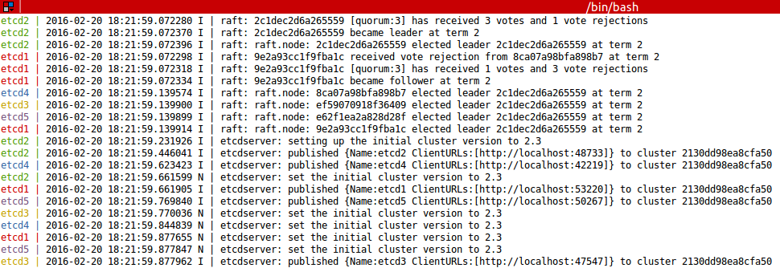
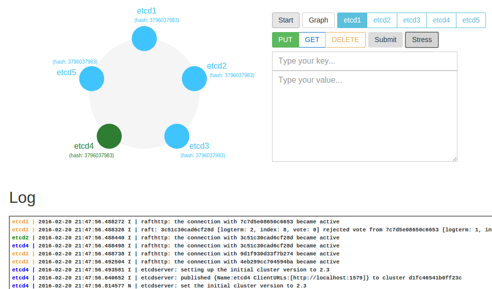
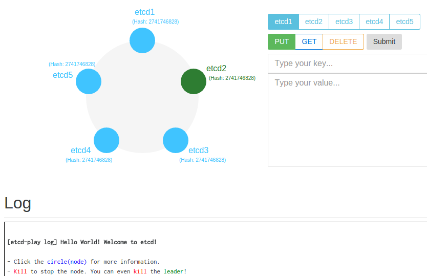

## etcd-play [](https://travis-ci.org/coreos/etcd-play) [](https://godoc.org/github.com/coreos/etcd-play)


<br>
#### Install

```
go get -v -u github.com/coreos/etcd
go get -v -u github.com/coreos/etcd/tools/functional-tester/etcd-agent
go get -v -u github.com/coreos/etcd-play
```

There are multiple ways to play [`etcd`](https://github.com/coreos/etcd).


<br>
#### Play `etcd` in local terminal

```
etcd-play terminal
```




<br>
#### Play etcd with local web browser


```
etcd-play web
```

Web demo will be served at <a href="http://localhost:8000" href="_blank">http://localhost:8000</a>.




<br>
#### Public etcd

```
etcd-agent  # deploy in machine1
etcd-agent  # deploy in machine2
etcd-agent  # deploy in machine3
etcd-agent  # deploy in machine4
etcd-agent  # deploy in machine5

AGENT_RPC_ENDPOINTS='10.0.0.1:9027,10.0.0.2:9027,10.0.0.3:9027,10.0.0.4:9027,10.0.0.5:9027'
etcd-play web --keep-alive --production --remote --agent-endpoints="$(echo $AGENT_RPC_ENDPOINTS)" 
```

Please visit <a href="http://play.etcd.io" href="_blank">http://play.etcd.io</a>.


